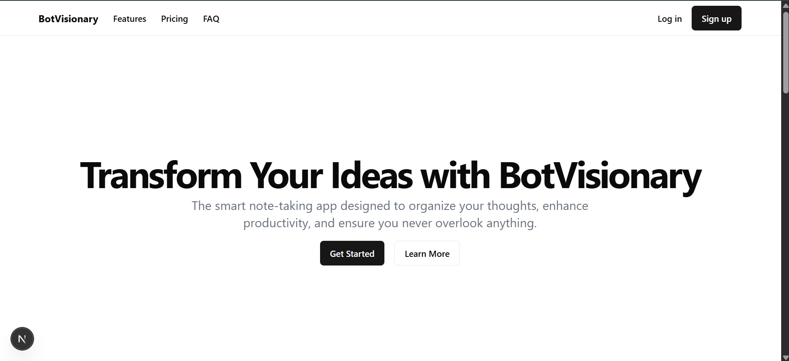
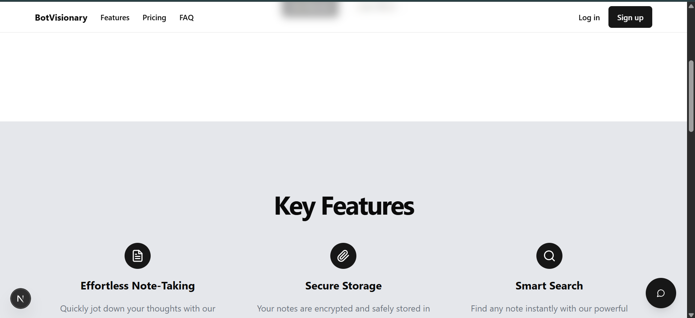
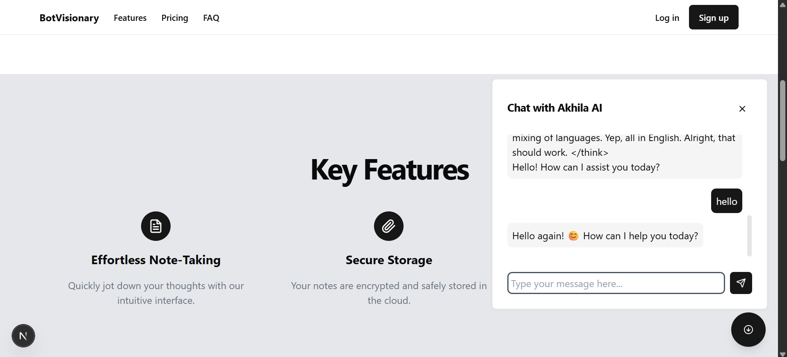

# 🤖 Akhila AI Chatbot

A sleek, animated chatbot widget powered by **DeepSeek R1 Distill LLaMA 70B** via the **Vercel AI SDK**. Designed with a mobile-friendly floating UI, real-time streaming, Markdown rendering, and smooth error handling.

Built using **Next.js App Router**, **TypeScript**, **Tailwind CSS**, and **shadcn/ui**.

---


## 🔐 Using DeepSeek for Free via OpenRouter.ai
You can use DeepSeek R1 70B for free through OpenRouter.ai.

Step 1: Create a Free API Key
Go to 👉 https://openrouter.ai/deepseek/deepseek-r1-0528:free/api

Sign in with Google or GitHub

Generate a free OpenRouter API key

Step 2: Update .env.local
env
Copy
Edit
DEEPSEEK_API_KEY=sk-your-openrouter-api-key
DEEPSEEK_BASE_URL=https://openrouter.ai/api/v1

✅ Note: No credit card required. You can use OpenRouter to access DeepSeek for free within their usage limits.

## 🧱 Tech Stack

| Category        | Stack Used                         |
|-----------------|------------------------------------|
| Framework       | Next.js 14 (App Router)            |
| Language        | TypeScript                         |
| Styling         | Tailwind CSS                       |
| UI Components   | shadcn/ui                          |
| Animations      | Framer Motion                      |
| Markdown        | react-markdown + remark-gfm        |
| AI Integration  | Vercel AI SDK + DeepSeek LLaMA 70B |

---

## ✨ Features

- ✅ Floating chatbot toggle button (appears after scrolling)
- ✅ Real-time AI response streaming
- ✅ Mobile-first, responsive UI
- ✅ Markdown rendering (code, lists, links)
- ✅ Dark mode ready
- ✅ Auto-scroll to latest message
- ✅ Error fallback with retry/abort
- ✅ Framer Motion for smooth animations

---

## 🚀 Getting Started

### 1. Clone the repository

```bash
git clone https://github.com/your-username/akhila-ai-chatbot.git
cd akhila-ai-chatbot
````

### 2. Install dependencies

```bash
npm install
# or
pnpm install
```

### 3. Add environment variables

Create a `.env.local` file in the root:

```env
DEEPSEEK_BASE_URL=https://api.deepseek.com/v1
DEEPSEEK_API_KEY=your_deepseek_api_key_here
```

### 4. Start the development server

```bash
npm run dev
# or
pnpm dev
```

Open [http://localhost:3000](http://localhost:3000) in your browser to use the chatbot.

---

## 🗂️ Project Img






---

## 🗂️ Project Structure

```
├── app/
│   └── api/
│       └── chatbot/route.ts        # API handler for streaming DeepSeek responses
├── components/
│   └── ChatWithAkhilaAI.tsx        # Chat UI with logic
├── lib/
│   └── utils.ts                    # Utility functions (e.g. ID generator)
├── public/                         # Static assets
├── styles/                         # Tailwind config and global CSS
├── .env.local                      # Environment variables (not committed)
├── README.md
```

---

## 📡 API Endpoint

### `POST /api/chatbot`

**Request:**

```json
{
  "messages": [
    { "role": "user", "content": "Hello!" }
  ]
}
```

**Response:**

* A streamed response using DeepSeek LLaMA 70B.
* Returned in `text/plain` (chunked transfer encoding).

---

## 📋 Example Usage

Test locally using curl:

```bash
curl -N -X POST http://localhost:3000/api/chatbot \
  -H "Content-Type: application/json" \
  -d '{
    "messages": [
      { "role": "user", "content": "What is Akhila AI?" }
    ]
  }'
```

---

## 📅 To-Do (Planned Enhancements)

* [ ] Chat history storage via Supabase or Firebase
* [ ] Voice input integration
* [ ] Theme customization (user preferences)
* [ ] Authentication + session memory

---

## 📄 License

This project is open-sourced under the **MIT License**.

---

## 👨‍💻 Credits

Built by [Vikas Kushwah](https://github.com/vikaskushwah738) using [DeepSeek R1 Distill LLaMA 70B](https://deepseek.com/) and the [Vercel AI SDK](https://vercel.com/ai).


